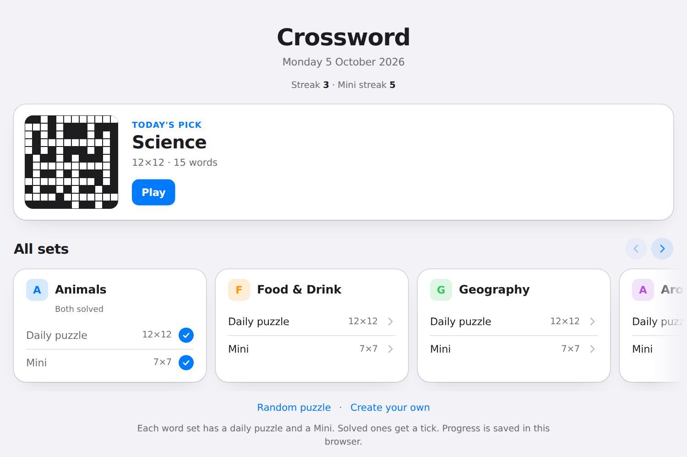
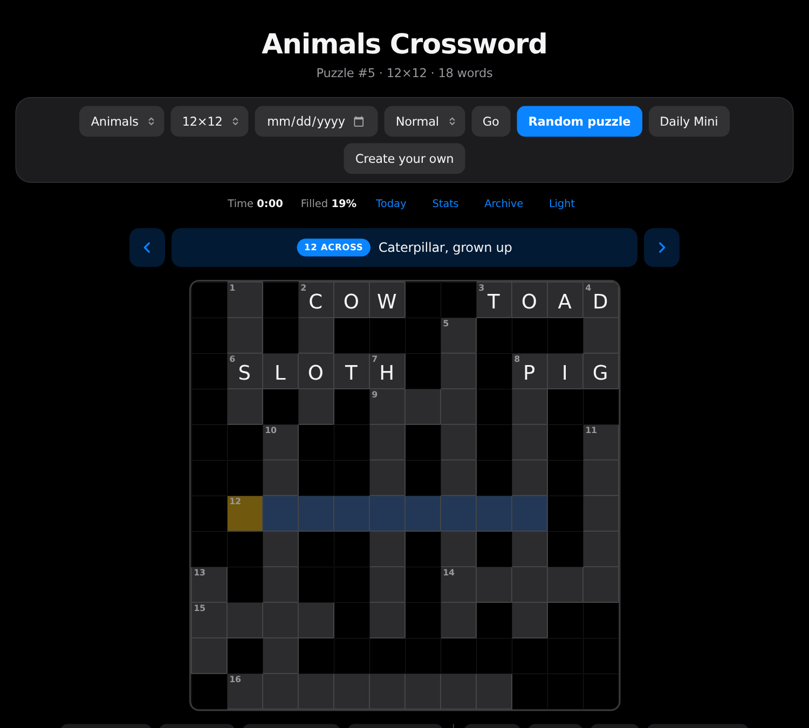
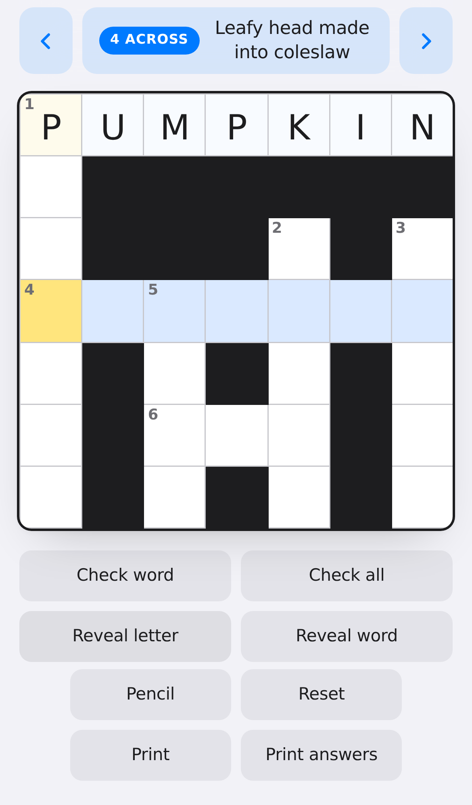

<div align="center">

# Crossword

**A daily crossword that runs entirely in your browser.**

No server, no build step, no account. Static HTML, CSS and JavaScript, hosted on GitHub Pages.

### [▶ Play now](https://ag-tawfik.github.io/CrosswordPuzzle/)

[](https://github.com/Ag-Tawfik/CrosswordPuzzle/actions/workflows/test.yml)
[](https://github.com/Ag-Tawfik/CrosswordPuzzle/actions/workflows/pages.yml)

<br>



<sub>Today, the front door: a featured pick with its grid, then every word set in a row that slides sideways.</sub>

</div>

<br>

## Highlights

| | |
|---|---|
| **A fresh puzzle every day** | Seven word sets, each with a daily 12×12 and a one-minute **Mini**. The same day gives everyone the same grid. |
| **Hard mode means harder** | Every one of the 703 words has an oblique second clue. *Spelling contest* for BEE, *Chomolungma, to Tibetans* for EVEREST. |
| **Challenge a friend** | One link carries the exact puzzle and your time to beat. They see the target while solving and the verdict when done. |
| **A proper solve** | Green sweeps the grid, the clock counts up, and a line tells you how you did against your own average. |
| **Streaks, stats, archive** | Best and average per grid size, daily and Mini streaks, and a calendar of every day you have solved. |
| **Make your own** | Paste words and clues, get a link that holds the whole puzzle. Nothing to host. |
| **Phone first** | The grid fits the screen, the active clue stays pinned, the keyboard stays open. Native pickers on phones, proper menus on desktop. |
| **Looks after itself** | Dark mode, pencil marks, print a blank grid or the answer key, progress saved locally. |

<br>

<div align="center">
<table>
<tr>
<td align="center"><br><sub>Dark mode on desktop</sub></td>
<td align="center"><br><sub>A Mini on a phone</sub></td>
</tr>
</table>
</div>

<br>

## Playing

**Moving around.** Tap or click a cell or a clue. Arrow keys move along the word; an arrow across the word switches direction, as do Enter, Space, or tapping the selected cell again. Typing fills the cell and moves to the next empty one, skipping letters a crossing already filled, then on to the next unfinished clue.

| Key | Does |
|---|---|
| `A`–`Z` | Enter a letter and move on |
| `Backspace` | Clear and step back |
| `Delete` | Clear without moving |
| `Enter` / `Space` | Switch between across and down |
| `.` | Toggle pencil mode |
| `Tab` | Leave the grid |

**Help, at a price.** *Check word* and *Check all* mark cells right or wrong without changing them, and are free. *Reveal letter* and *Reveal word* fill in answers, and each revealed letter adds **20 seconds** to the clock, shown beside the timer and in your result.

**Difficulty.** *Easy* marks wrong letters as you type. *Normal* waits for you to check. *Hard* hides check and reveal and swaps every clue for a harder one. In every mode, a full grid with a mistake somewhere says so, without saying where.

**Finishing.** The grid sweeps green, the time counts up, and a verdict compares you with your earlier solves of the same size. *Share* copies your result; *Challenge a friend* copies a link with your time to beat.

**Around the game.** *Today* lists every set's daily and Mini. *Archive* is a calendar of the current set with solved days filled in, each a link. *Stats* shows solves, streaks, and best and average times per size. *Reset* clears the grid after asking. *Dark* switches the theme, which follows your system by default.

Progress, stats, mode and theme live in your browser. A streak counts consecutive days on which you solved that day's puzzle; the Mini keeps its own.

## Links

Every puzzle is a URL, so any of them can be shared, bookmarked or replayed.

| Parameter | Meaning | Default |
|---|---|---|
| `set` | Word set: the file name in `words/` without `.json`, or `mixed` for every set in one pool | `animals` |
| `size` | Grid size, 8 to 20 | `12` |
| `seed` | Puzzle number; the same number always gives the same puzzle | Today's date, on your clock |
| `date` | A past day's daily, as `YYYY-MM-DD`. Overrides `seed` | |
| `mini` | `1` for the Mini, a 7×7 of the set. Overrides `size` | |
| `custom` | A puzzle made on the create page. Overrides `set` | |
| `beat` | A challenge: seconds to beat on this exact puzzle. Made by the *Challenge a friend* button | |

No parameters at all shows Today.

```text
index.html?set=food                         today's food puzzle
index.html?set=sports&mini=1                today's sports Mini
index.html?set=animals&date=2026-03-01      the animals puzzle from that day
index.html?set=geography&size=15&seed=4242  a specific, shareable puzzle
index.html?set=mixed                        today's puzzle drawn from every set
```

## Making your own

Open `create.html`, give the puzzle a title, and enter one word per line as `WORD: clue`. The page builds a link that contains the whole puzzle, so there is nothing to host or save, and anyone with the link gets the same grid. Words that do not fit the chosen grid size are left out.

## Running it locally

```sh
npm run serve
```

then open http://127.0.0.1:8000/. Opening `index.html` straight from disk does not work, because the page fetches the word sets.

**GitHub Pages.** The workflow in `.github/workflows/pages.yml` publishes the repository root on every push to `main`. To turn it on once: in the repository settings, under Pages, set the source to **GitHub Actions**. The site then lives at `https://<owner>.github.io/<repo>/`.

## Word sets

Each set is a JSON file in `words/`, listed in `words/index.json`. A word may have one clue or several; which one appears depends on the puzzle number, so repeats vary. The optional `hard` block holds the clue hard mode uses.

```json
{
  "name": "Animals",
  "words": {
    "CAT": ["Purring house pet", "Whiskered animal with nine lives, they say"],
    "DOG": "Loyal companion that barks"
  },
  "hard": {
    "CAT": "Burglar or walk, with a nine-lives reputation",
    "DOG": "Hot one in a bun, or a hound"
  }
}
```

<details>
<summary>Rules and sizes</summary>

- Words are letters only, at most ten letters so they fit the smallest grid offered.
- A word without a hard clue keeps its normal clue in hard mode. The shipped sets have a hard clue for every word, and the tests insist on it.
- A set should hold well over what a grid can use: the shipped sets hold 89 to 135 words, and a 12×12 places 15 to 20 of them. Bigger sets give more varied puzzles; the generator makes fewer attempts for them so the cost stays flat.
- Add a file to `words/index.json` and it appears in the menu, on Today, and in the Mixed set, which is every listed set merged. Mixed is far bigger than a grid can use, so each puzzle draws a hand of 150 words chosen by the puzzle number.
- Crossword rules are enforced: every word crosses another, no side-by-side or end-to-end joins, clues numbered in reading order.

</details>

## How it works

1. `app.js` reads the URL, loads the word set and seeds the random generator with the puzzle number.
2. The longest word goes across the middle.
3. Each remaining word is placed where it crosses an existing word, choosing at random among legal positions. Words that do not fit are retried after each pass.
4. The whole process runs many times and the layout that fits the most words wins.
5. Words are numbered in reading order and handed to the game.
6. `crossword.js` renders the grid, routes all typing through one hidden input so phone keyboards stay open, saves progress and detects completion.

## Project layout

| File | Role |
|---|---|
| `index.html`, `app.js` | The puzzle page, Today, and the bootstrap that reads the URL |
| `create.html`, `create.js` | The custom puzzle builder |
| `generator.js` | Grid, placement rules, numbering, word sets, seeded random. Runs in the browser and in Node |
| `crossword.js` | The game: rendering, navigation, checking, celebration, stats, archive, challenges |
| `menu.js` | Desktop menus drawn over the native selects, which stay the form fields |
| `crossword.css` | Styles, including dark mode and print |
| `words/` | Word sets, listed in `index.json` |
| `docs/` | Screenshots for this page |
| `tests/` | Generator tests, browser tests in Chromium, and the small static server they share |
| `.github/workflows/` | `test.yml` runs the tests on every push; `pages.yml` deploys `main` |

## Tests

```sh
npm install
npx playwright install chromium
npm test
```

`npm test` runs a syntax check, the generator tests and the browser tests; each has its own script. The browser tests start the static server on a free port and treat any console error, failed request or 4xx/5xx response as a failure, so a missing asset fails the suite.

## License

Open source, free for personal and educational use. Forks and pull requests welcome.
